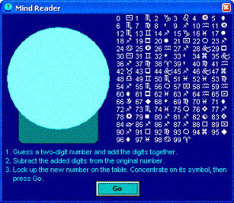



## Mind Psychic

### Description

A little program where you think of a number and it shows it! You have to run it to see, but I think you will be quite amazed how it does it!
 
### More Info
 
If you can't figure it out and are about to take a sledgehammer to your screen, read the I give up.txt file in the archive.

             |
---                |---
**Submitted On**   |2003-04-12 17:15:02
**By**             |[Marshall H\.](https://github.com/Planet-Source-Code/PSCIndex/blob/master/ByAuthor/marshall-h.md)
**Level**          |Intermediate
**User Rating**    |4.4 (44 globes from 10 users)
**Compatibility**  |VB 3\.0, VB 4\.0 \(16\-bit\), VB 4\.0 \(32\-bit\), VB 5\.0, VB 6\.0
**Category**       |[Games](https://github.com/Planet-Source-Code/PSCIndex/blob/master/ByCategory/games__1-38.md)
**World**          |[Visual Basic](https://github.com/Planet-Source-Code/PSCIndex/blob/master/ByWorld/visual-basic.md)
**Archive File**   |[Mind\_Psych1572794122003\.zip](https://github.com/Planet-Source-Code/marshall-h-mind-psychic__1-44697/archive/master.zip)

